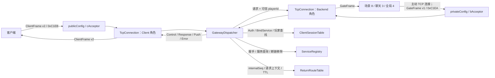
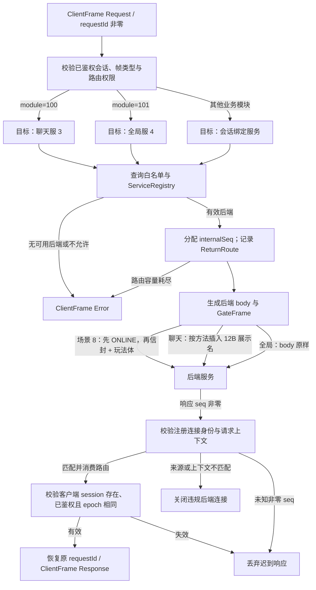
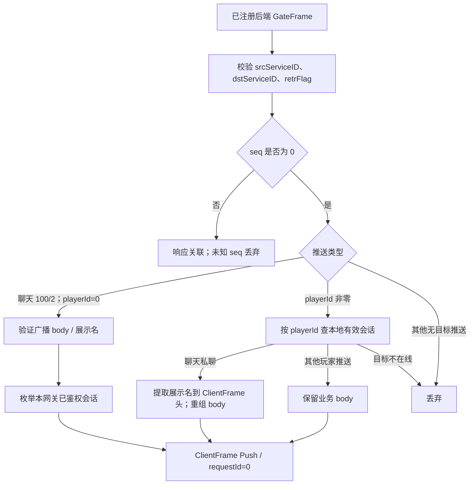
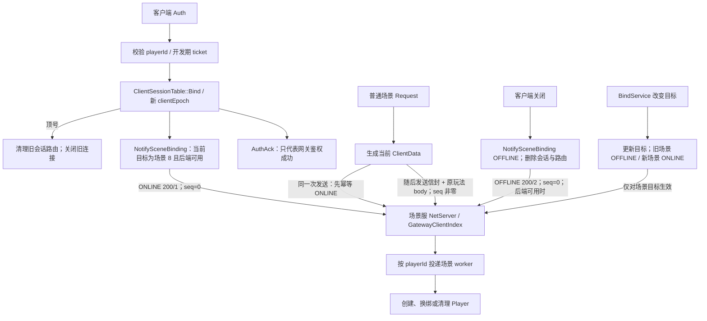

# 网关服务器（gatewayServer）

区服客户端接入与内部服务路由入口，默认客户端端口 `127.0.0.1:10000`、后端端口 `127.0.0.1:13145`。客户端与后端协议严格隔离；网关是连接与可信会话边界，不是玩法服或正式登录服。

下文 Mermaid 图按当前源码展示数据流，箭头上的字段用于说明数据转换，不表示消息已可靠送达。示例使用本机绝对路径，检出目录不同时请替换 `/home/lanxiyuan/Project_Cpp/GameServer`。

## 内部功能

- **面向客户端**：公网端口接收 `ClientFrame`，处理鉴权、绑定目标服务、Ping/Pong 和业务请求；维护会话与玩家身份。
- **面向后端**：内网端口接受场景服、聊天服、全局服的反向连接，验证握手、区服 ID 和服务号白名单。
- **双向转发**：将客户端请求转成 `GateFrame`；依据回程路由返回响应，或按玩家 ID 转发后端推送。
- **场景玩家绑定**：向服务号 `8` 发送 ONLINE/OFFLINE 和版本化绑定信封；普通场景业务发送前再次幂等声明 ONLINE。

## 职责边界

- 网关负责连接、会话、服务注册和转发；不执行场景玩法逻辑，不解析业务 protobuf，也不直接访问玩家数据库。
- 公网和内网分别使用独立的端口、连接角色与帧魔数；收到另一套协议的魔数会断开，而非混用。
- 玩家身份取自鉴权后的会话，客户端业务帧不能指定可信玩家或任意目标地址。`BindService` 只能绑定白名单内的服务；预定义的聊天/全局模块会定向路由，其余业务按会话目标服务转发。
- 当前 `clientToken` 是开发期预共享票据，不是正式登录令牌；设为 `0` 会禁用票据校验，**仅限联调**。明文后端握手不能提供密码学认证，尚未实现 TLS、主动健康探测或网关进程的信号驱动优雅停服。

## 与 Client 的消息流

```text
Client -- ClientFrame --> publicConfig 端口 / cAcceptor_
       --> TcpConnection(role=Client) --> GatewayDispatcher
       --> ClientSessionTable（鉴权、服务绑定、玩家身份）
       --> ReturnRouteTable（在途请求） --> 后端连接
Client <-- ClientFrame <-- GatewayDispatcher <-- 后端响应/推送
```

### 接入、注册与转发总览图



主 `baseLoop` 管理监听与连接索引，连接 IO 回调在所属事件循环处理。两类连接使用不同解码入口，不能通过在客户端端口发送后端握手来注册服务。

### 消息定义

客户端帧 v2 固定头 **32 B**，魔数 `0xC1EB`、版本 `2`（不兼容旧 v1 客户端）：

| 字段 | 长度 | 含义 |
| --- | ---: | --- |
| magic / version / kind | 2 / 1 / 1 B | `ClientKind`：Request=1、Response=2、Push=3、Error=4、Control=5 |
| module / method | 2 / 2 B | 模块与方法；`module=1` 为客户端 SYS 控制通道 |
| requestId / totalLen | 8 / 4 B | 会话内请求号；总长度包含 32 B 头 |
| roleName | 12 B | UTF-8 角色名、右侧补零；最长 12 字节，不能用于鉴权 |
| body | 可变 | 控制体或业务体；整帧上限 64 KiB |

头部多字节整数使用**网络序（大端）**，定长控制体使用**小端**。权威定义见 `/home/lanxiyuan/Project_Cpp/GameServer/Zone/zone_common/base/clientProto.h`，详细偏移见 `/home/lanxiyuan/Project_Cpp/GameServer/Zone/PROTOCOL.md`。客户端只可发送 `Control(module=1)` 或 `Request(module!=1)`；不能自行发送 Response、Push 或 Error。

| 控制方法（`ClientSysMethod`） | 方向 | 内容 |
| --- | --- | --- |
| `kAuth=1` / `kAuthAck=2` | C→G / G→C | `playerId(u64)+ticket(u64)`；成功回传 playerId、sessionId、epoch、zoneId、目标服务 |
| `kBindService=4` / `kBindServiceAck=5` | C→G / G→C | 白名单内的 `serviceId(u8)` |
| `kPing=6` / `kPong=7` | C→G / G→C | 心跳应答；当前 Pong 体为空 |
| `kAuthFail=3` / `kError` | G→C | 鉴权失败或拒绝，错误体为文本；通用拒绝沿用原请求方法号 |

业务请求须先鉴权且 `requestId` 非零。鉴权失败、未鉴权访问、后端不可用或容量耗尽时发送 `kError`；同一玩家重新登录会顶掉旧会话并清理旧路由。

聊天模块 `100/1`（私聊）和 `100/2`（全区喊话）要求请求头提供非空角色名；网关将该字段插入发往聊天服的业务体。
聊天服回推时网关从推送体读取名字并填入客户端 Push 帧头。名字仅由客户端提供，
**可以伪造，不能用于鉴权或权限判断**。全局服务模块 `101/1` 仍回显 body，不使用名字。
聊天服 `100/2` 的广播推送使用 `seq=0,playerId=0`；网关仅对本地已鉴权会话分发。管理员方法 `100/3` 当前无可信权限来源，只能收到拒绝响应。

### 网关将结果返回给客户端

```text
Request(requestId) --> 会话获取 playerId/目标服务 --> 分配 internalSeq
  --> 记录 (internalSeq -> sessionId, requestId, epoch, module/method, 目标服务)
  --> GateFrame(seq=internalSeq) --> 后端
后端响应(seq=internalSeq) --> 校验来源与上下文 --> 消费回程路由
  --> ClientFrame(kind=Response, requestId=原请求号)
后端推送(seq=0, playerId!=0) --> 按玩家找到会话 --> ClientFrame(kind=Push, requestId=0)
```

非零但未知的 `seq` 不会当成推送；过期、断线或被顶号会话的响应会丢弃。

### 请求与回程数据流图



`ReturnRoute` 保存 `internalSeq → clientSessionId/clientRequestId/sessionEpoch/playerId/module/method/backendServiceId`。不同客户端可使用相同 requestId，由网关内部 seq 隔离。TTL 清理仅回收路由，当前不发送主动超时响应，也不自动重试业务请求。

### 后端推送数据流图



聊天跨网关扇出由聊天服完成，网关仅筛选本地在线会话。普通响应不能因为 playerId 当前在线就绕过回程路由；广播仅支持代码中明确允许的聊天喊话，不能将任意 `playerId=0` 帧视为全区广播。

## 与 BackendServer 的消息流

后端启动后**主动连接网关内网端口**，先发送 `GateFrame(module=SYS, method=kHandshake)` 注册。服务间帧固定头 **32 B**、魔数 `0xC1EA`、版本 `1`；包含 `msgType/retrFlag/module/method/seq/playerId/totalLen/srcServiceID/dstServiceID`，整帧上限 10 MiB。`msgType` 是链路标识，**不是**请求/响应/推送类别。定义见 `/home/lanxiyuan/Project_Cpp/GameServer/Zone/zone_common/base/proto.h`。

```text
Backend -- 握手 GateFrame --> privateConfig 端口 / bAcceptor_
        --> GatewayDispatcher 校验白名单、zoneId 和握手头 --> ServiceRegistry 登记
Client Request --> 网关组 GateFrame(src=网关, dst=目标服务, seq=internalSeq,
                                    playerId=会话玩家) --> Backend
Client <-- ClientFrame <-- 网关回程路由 <-- GateFrame 响应/主动推送 <-- Backend
```

握手体为 `serviceId(u8)+zoneId(u32 小端)+sceneId(u32 小端)`，共 9 B；头部整数为大端。未注册后端不能发送业务帧，同号重连替换旧连接。正常响应应沿用请求 `seq/module/method/playerId`；网关会校验已注册连接身份及请求上下文。当前 `sceneId` 只记录，不用于多实例路由，握手成功没有协议层 Ack。

### 场景玩家绑定数据流图



场景信封位于 GateFrame body 开头，32 B，字段均为小端：`magic(u16=0x4750)、version(u16=1)、playerId(u64)、clientSession(u64)、clientEpoch(u32)、gatewayId(u32)、sceneId(u32)`，随后为原始玩法 body。定义见 `/home/lanxiyuan/Project_Cpp/GameServer/Zone/zone_common/base/gatewayPlayer.h`。专用 `module=200` 不允许客户端借场景业务路由指定。

注意事项：

- 客户端 session、场景服内部连接 session、Actor epoch 与 clientEpoch 是不同概念。
- AuthAck 不等待场景 ONLINE 已应用，不表示角色加载或进场成功。每条场景请求前的 ONLINE 是幂等声明，不是可靠在线集合对齐协议。
- 顶号由新的 ONLINE 更新绑定，旧会话关闭不能笼统描述为必定发送 OFFLINE；场景服根据精确绑定/世代过滤旧通知。
- 网关发送 OFFLINE 不承诺场景已应用；内部链路关闭时由场景服枚举该连接绑定并逐玩家清理。
- 目前只针对 `kScene_1=8` 包装绑定信封；网关/场景服须同步升级。多网关 ID 必须稳定且区服内唯一，跨网关权威接管、同 epoch 断线恢复及进程重启后的世代恢复尚未完善。

## 内部组件

| 组件 | 职责 |
| --- | --- |
| `main.cpp` / `GatewayConfig` | 加载并校验配置，初始化日志、主事件循环及网关。 |
| `GatewayServer` / `Acceptor` | 两个监听器、连接索引、IO 线程池及定期路由清理。 |
| `TcpConnection` | TCP 缓冲、连接角色和连接级流量状态。 |
| `GatewayDispatcher` | 两种帧的处理、鉴权、握手、转发、回包和统计。 |
| `ClientSessionTable` | 会话、玩家绑定、目标服务及顶号。 |
| `ServiceRegistry` | 待注册后端及服务号到连接的映射。 |
| `ReturnRouteTable` | 内部 `seq` 到原客户端请求的映射；容量、TTL 与会话删除。 |

核心接口：`GatewayServer::start/stop` 管理传输层；`GatewayDispatcher::OnClientConnected/Closed`、`OnBackendConnected/Closed` 维护状态；`OnClientMessage/OnBackendMessage` 处理帧，`SweepRoutes` 清理超时请求。`GatewayServer` 在主 `baseLoop` 维护连接索引；连接数据在所属 IO 线程的回调中分发。

## 内部消息处理流程

1. `main.cpp` 加载配置，启动两个 `Acceptor` 及 IO 线程池；按端口赋予 Client/Backend 角色。
2. 收到数据先检查魔数和角色，再按对应帧格式解码，并执行读缓冲、解码错误和帧速率限制。
3. 客户端控制帧完成鉴权、绑定或 Pong；业务帧检查会话与后端，记录有界回程路由后转发。
4. 后端握手后注册；响应由内部序号查回程路由，推送按玩家找会话；连接断开或 TTL 到期时清理状态。

## 配置、构建与运行

网关配置为 `/home/lanxiyuan/Project_Cpp/GameServer/Zone/gatewayServer/config/gatewayConfig.yaml`。`publicConfig` 只接客户端，`privateConfig` 只接后端；`allowedServices` 必须显式配置，`defaultServiceId` 也必须位于白名单中。`maxClientSessions`、`maxPendingRoutes`、`routeTtlMs` 控制容量与清理。

默认本机配置已对齐：`publicConfig` 的客户端入口为 `127.0.0.1:10000`，`privateConfig` 的后端入口为 `127.0.0.1:13145`；共享配置 `/home/lanxiyuan/Project_Cpp/GameServer/Zone/config/zoneConfig.yaml` 的 `ZoneServer.gateways` 指向后者。跨机器部署仍需将内网监听和网关列表改为可达的内网地址，并限制内网访问。

默认 `zoneId=1`、`gatewayId=1`、`clientToken=998877`、`defaultServiceId=8`，白名单仅含 `8`。要运行聊天/全局服务，须保留 `8` 并加入 `3`、`4`，且使用分行列表；轻量 YAML 解析器不支持 `[8, 3, 4]`：

```yaml
allowedServices:
    - 8
    - 3
    - 4
```

从网关目录执行，默认配置路径是相对当前工作目录的 `./config/gatewayConfig.yaml`：

```bash
cmake -S /home/lanxiyuan/Project_Cpp/GameServer/Zone \
  -B /home/lanxiyuan/Project_Cpp/GameServer/Zone/build-readme -DSCENE_BUILD_TESTS=ON
cmake --build /home/lanxiyuan/Project_Cpp/GameServer/Zone/build-readme --target gatewayServer -j 4
cd /home/lanxiyuan/Project_Cpp/GameServer/Zone/gatewayServer
/home/lanxiyuan/Project_Cpp/GameServer/Zone/build-readme/bin/gatewayServer \
  /home/lanxiyuan/Project_Cpp/GameServer/Zone/gatewayServer/config/gatewayConfig.yaml
```

可以把配置文件绝对路径作为第一个参数传入。日志固定输出到运行目录的 `./logs`；当前 `SIGTERM` 直接终止网关进程，**不是**优雅停服。

测试（需构建测试目标，端到端用例依赖相应后端目标及 `python3`）：

```bash
cmake --build /home/lanxiyuan/Project_Cpp/GameServer/Zone/build-readme -j 4
ctest --test-dir /home/lanxiyuan/Project_Cpp/GameServer/Zone/build-readme \
  --output-on-failure -R '^gateway_'
```

`gateway_tests` 验证协议、配置与路由表；`gateway_smoke` 验证双端口；`gateway_e2e` 使用模拟后端；`gateway_real_scene` 使用真实场景进程；`gateway_chat_global` 验证聊天/全局联调。测试用临时配置，不验证正式鉴权或外部数据库。

当前模拟后端 `gateway_e2e` 仍需适配新增 ONLINE 帧：旧测试直接把 Auth 后读到的帧断言为移动请求，会造成 module/method/seq 断言失败；应单独修复测试，不把该用例失败等同于真实场景主链路失败，也不宣称全量测试通过。

## 常见排障与交付边界

| 现象 | 检查项 |
| --- | --- |
| 后端注册失败 | 连接的是内网端口、zoneId 一致、白名单含对应服务、握手身份正确 |
| 客户端业务被拒绝 | 已 Auth、Request 类型正确、requestId 非零、目标后端已注册、路由容量未满 |
| 响应被丢弃 | seq 是否有效、来源与 playerId/module/method 是否匹配、会话 epoch 是否过期 |
| 玩家进不了场 | AuthAck 不等于进场；还需发送场景 `3/4` 的 EnterSceneReq |
| 聊天无推送 | 展示名/body 格式、目标是否在已配置网关在线、聊天进程链路是否存活 |

当前缺少正式登录凭证、加密传输、可靠生命周期确认、自动故障恢复和信号驱动优雅停服。TTL 不是可靠超时协议，send 成功不是送达确认；聊天 `accepted` 不是接收/已读确认。网关转发能力不能被视为完整生产游戏后端。
