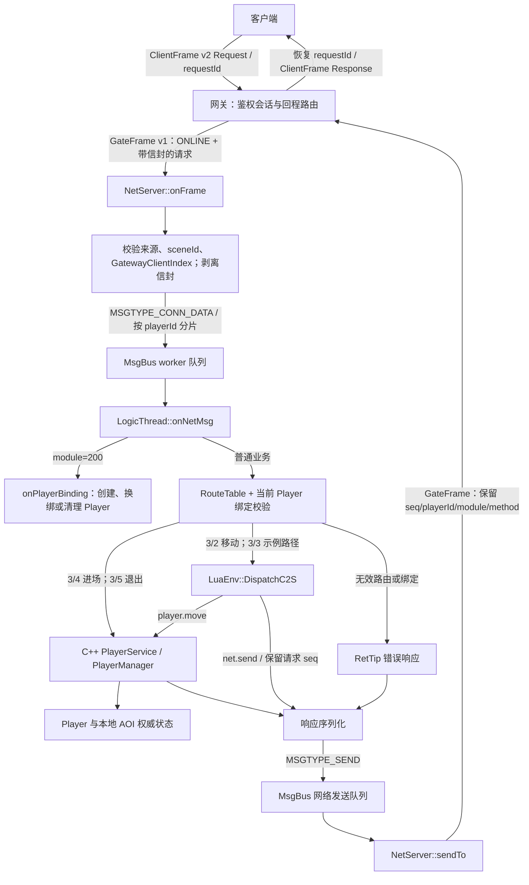
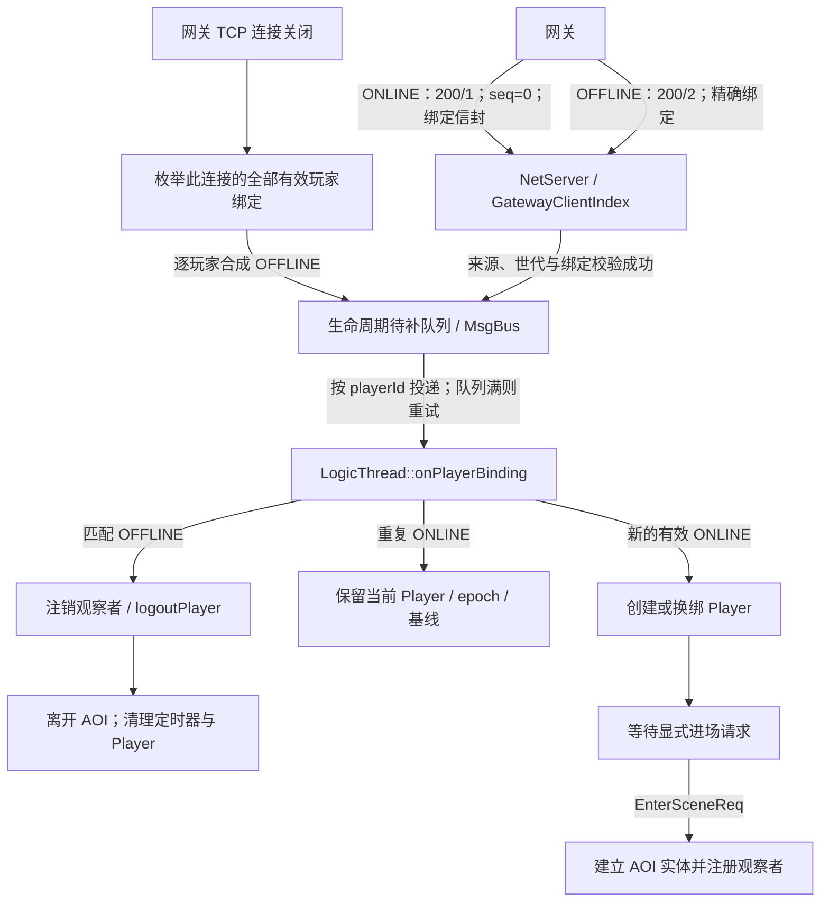
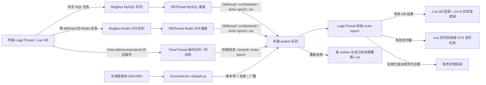
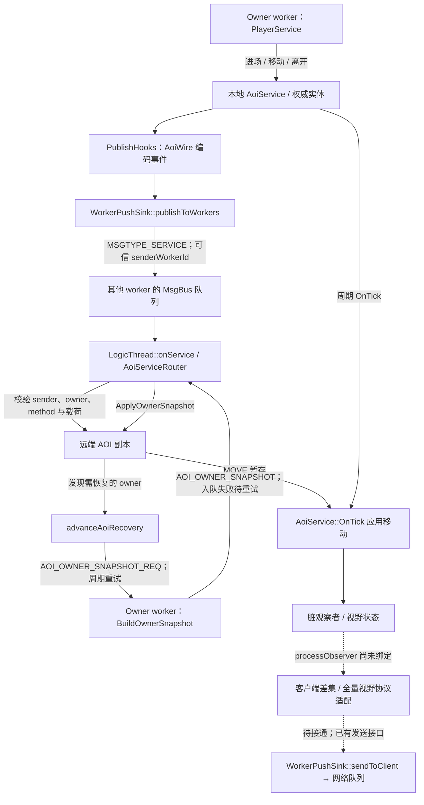

# 场景服务器（sceneServer）

## 约定
- 场景服是内部服务，不直接接收客户端 `ClientFrame`。默认主动连接网关，`ConnNew/ConnClose` 表示内部 TCP 链路事件，不能等同于某个玩家上下线。
- 玩家上线/下线由网关版本化绑定信封表达；网络层校验后通过消息总线投递到玩家所属逻辑 worker。普通玩法请求只能使用已有绑定，不能隐式创建 Player。
- 当前入站玩法为进场、移动、示例路径和退出；战斗与完整客户端视野同步尚未实现。
- 下文 Mermaid 图展示当前数据流。实线表示已接通链路；标注“未绑定”的虚线表示已有接口但尚未接通的客户端视野处理，不代表功能已经完成。

## 内部功能

### 网关玩家绑定（新增，需网关与场景服同步升级）

- GateFrame v1 的 32 字节头不变；网关发往 `kScene_1` 的玩家消息 body 使用 `base/gatewayPlayer.h` 中的版本化信封。场景服剥离信封后才将玩法载荷交给 Lua，不接受旧的裸 body 玩家请求。
- 信封为小端：magic(u16=0x4750)、version(u16=1)、playerId(u64)、clientSession(u64)、clientEpoch(u32)、gatewayId(u32)、sceneId(u32)，共 32 字节，随后为原始玩法载荷。
- 网关专用 module=200，method=1/2 表示 ONLINE/OFFLINE，载荷为空、seq=0。该路由不允许公网客户端指定。ONLINE 表示有效会话绑定，不表示数据加载完成或 AOI 场景准入成功。
- `NetServer` 独占 `GatewayClientIndex`：网关连接 session -> 多个玩家绑定，另有玩家到连接的反向索引及历史世代。普通请求只校验绑定，不能创建/换绑；离线精确匹配；断链为该连接的全部有效绑定产生逐玩家离线通知。
- 生命周期向 worker 投递失败会排队按顺序重试；积压期间普通玩法请求可被丢弃，不自动重放非幂等业务。待补队列及历史世代目前尚无容量/租约回收策略，正式部署前需增加预算和告警。
- `onNetMsg()` 先处理网关绑定通知。只有 ONLINE 创建/换绑 Player，普通合法玩法路由也不能隐式创建 Actor。Player 保存当前 ClientData；`Player::session()` 仍是场景服网络连接，不是客户端 session。`clientEpoch` 与 Actor epoch 分开使用。
- `ConnClose` 仅处理内部链路日志，不再删除某个“最后出现的玩家”。当前断链策略为该连接绑定的玩家全部下线；业务需要断线保留/租约等待时应调整此策略。
- 登录业务须在数据加载与准入成功后调用 `player.enter_scene`；绑定鉴权不自动进入 AOI。进场后使用已验证的 clientEpoch 注册观察者。网络层不读取 Player 或 AOI。

网关当前在 Auth、服务绑定时尝试发送 ONLINE，且在**每条场景业务请求之前**发送一次幂等 ONLINE，再发送带信封的业务帧。重复 ONLINE 不清空视野基线、不提升 Actor epoch；不能据此宣称已实现断线重连后的可靠在线集合恢复。

当前限制：gatewayId 必须稳定且区服内唯一；跨网关覆盖拒绝，尚未实现权威接管凭证。网关本地 epoch 重启回绕、后端连接重连后同 epoch 恢复、可靠在线集合对齐尚未实现。网关 TCP send 不承诺离线通知已应用；链路关闭由场景服逐绑定清理兜底，但进程崩溃、连接存活而通知丢失仍需租约/快照。现有后端寻址仍是 serviceId 单实例，不将此次 sceneId 校验误认为多场景路由已经完成。

- **面向网关**：主动连接区服共享配置中的网关内网地址，使用 `GateFrame` 握手、收发业务消息；本地直连监听默认关闭。
- **面向玩法**：按 `(module, method)` 路由 protobuf 请求，在玩家所属的逻辑线程中执行 Lua 处理器并生成响应或推送。
- **面向数据和定时任务**：通过消息总线异步处理 MySQL/Redis 任务、定时回调、玩家状态保存与 Lua 热更新。

## 职责边界

- 客户端只连接网关的 `ClientFrame` 端口；场景服处理服务间 `GateFrame`，不负责客户端鉴权、登录票据验证或公网接入。
- `NetServer` 持有网络连接与编解码，`LogicThread` 持有各自的 Lua VM 和玩家分片；数据库与定时器线程各司其职，跨线程只通过 `MsgBus` 投递消息。
- 按 `playerId` 路由玩家请求到所属 worker；没有玩家 ID 时按会话分配。无效的 `(module, method)` 在创建玩家 Actor 之前拒绝。
- 仅实现路由表中登记的玩法请求。进场/退出由 C++ 处理，移动/示例路径由 Lua 处理；其他未实现处理器明确返回错误。`net.listenEnable` 仅供本地联调/工具，不应作为公网客户端入口。

## 与 Client 的消息流

场景服**不直接收发**客户端帧，客户端先经网关鉴权和转发：

客户端链路当前使用 `ClientFrame v2`（32 字节头、版本 2、12 字节角色名）；
场景服仍仅接收 `GateFrame v1`，不会解析客户端角色名。

```text
Client -- ClientFrame(Request) --> Gateway -- GateFrame --> SceneServer
Client <-- ClientFrame(Response/Push) <-- Gateway <-- GateFrame <-- SceneServer
```

### 请求与响应数据流图



`Player::session()` 是场景服与网关的内部连接 session；信封中的 `clientSession` 是网关客户端会话。两者不能互换。网络发送入队成功不代表客户端已经收到，ONLINE 也没有场景准入成功的含义。

网关从已鉴权会话写入 `playerId`、内部 `seq` 和目标服务号；场景服接收业务帧并回复到原连接。网关要求普通响应保持原请求的 `seq/playerId/module/method`，才能按回程路由还原客户端 `requestId`。详见 `Zone/gatewayServer/README.md` 与 `Zone/PROTOCOL.md`。

### 消息定义

服务间帧固定头 **32 B**，魔数 `0xC1EA`、版本 `1`：

| 字段 | 长度 | 含义 |
| --- | ---: | --- |
| magic / version | 2 / 2 B | 协议标识与版本 |
| msgType / retrFlag | 1 / 1 B | 链路类型和重试标记；`msgType` 不是请求/响应类别 |
| module / method | 2 / 2 B | 系统或玩法模块与方法 |
| seq / playerId | 8 / 8 B | 请求关联号、玩家 ID；主动推送 `seq=0` |
| totalLen / srcServiceID / dstServiceID | 4 / 1 / 1 B | 总长度含帧头，源和目的服务号 |
| body | 可变 | 握手或玩法数据；整帧上限 10 MiB |

头部多字节整数为**网络序（大端）**；握手体里的 `zoneId`、`sceneId` 为**小端**。定义见 `Zone/zone_common/base/proto.h`，当前路由表位于 `Zone/sceneServer/src-cpp/routeTable.cc`，不是由示例路由 YAML 动态加载。

| module/method | 请求 → 响应 | 处理位置 |
| --- | --- | --- |
| `3/2` | `gs.WalkReq` → `gs.WalkAck` | Lua `move.c2s_walk`，经 PlayerService 更新权威位置/AOI |
| `3/3` | `gs.PathReq` → `gs.PathAck` | Lua `move.c2s_path`，返回固定示例路径，不是真实寻路 |
| `3/4` | `gs.EnterSceneReq` → `gs.EnterSceneAck` | C++ 进场处理 |
| `3/5` | `gs.LogoutReq` → `gs.LogoutAck` | C++ 退出处理 |
| `200/1`、`200/2` | ONLINE、OFFLINE，无业务载荷，`seq=0` | 网关专用生命周期处理，不开放给客户端 |

另有仅出站的 `gs.SCPushState`、`gs.RetTip` 路由；登记出站类型不等于完整视野推送已经实现。

### 场景服将结果返回给客户端

```text
GateFrame --> NetServer::onFrame --> MsgBus（玩家/会话所属 worker）
          --> LogicThread::onNetMsg --> RouteTable::FindC2S
          --> LuaEnv::DispatchC2S --> MsgBus 网络发送队列
          --> NetServer::sendTo --> GateFrame --> Gateway --> ClientFrame
```

无效路由会返回 `gs.RetTip{code=1001,text="route not found"}` 且不创建 Actor。关联请求的错误响应沿用原请求的 `module/method/seq/playerId`，因此能通过网关回程路由并恢复客户端 `requestId`；客户端需在该请求的 Response body 中识别 `gs.RetTip`（当前服务间协议没有显式错误类别）。无关联请求的 RetTip 通知仍使用 SYS 模块/方法。

## 与 BackendServer 的消息流

场景服本身是网关的后端服务：启动后从 `ZoneServer.gateways` 读取地址，**反向连接网关内网端口**，发送 `GateFrame(module=SYS, method=kHandshake)`。握手体是 `serviceId(u8)+zoneId(u32 小端)+sceneId(u32 小端)`，共 9 B；出站 `srcServiceID` 取 `SceneServer.serviceId`，示例为 `8` (`ServerID::kScene_1`)。网关检查区服 ID 与白名单，注册前不接受业务帧；同服务号重新注册会替换旧连接。

```text
SceneServer NetServer -- 握手 GateFrame --> Gateway privateConfig 端口
Gateway -- 业务 GateFrame(dst=SceneServer.serviceId) --> NetServer
NetServer -- 响应/推送 GateFrame(dst=ServerID::kGateway) --> Gateway
```

网络层处理非阻塞收发、帧解码及缓冲/帧速率限制；当前没有完整的后端心跳或同服务号多实例路由能力。

### 玩家绑定与断链清理数据流图



网络层先更新绑定索引，再排队向逻辑层投递生命周期。待补队列积压时普通玩法可能被丢弃，不自动重放。主动 `LogoutReq` 走玩法分支清理 Player；它不是客户端直接发送 OFFLINE，也不等同于注销网关鉴权会话。

## 内部组件

| 组件 | 职责 |
| --- | --- |
| `main.cc` / `ZoneConfig` / `SceneConfig` | 加载共享与场景专属配置、合并校验、初始化日志和路由表、等待信号。 |
| `SceneServer` | 组装和管理总线、网络、定时器、DB 和逻辑 worker；热更新 Lua。 |
| `NetServer` | 网关反向连接、可选本地监听、握手及 `GateFrame` 收发。 |
| `MsgBus` | 多条 worker 队列、网络发送队列、MySQL 队列与 Redis 分片队列。 |
| `LogicThread` / `PlayerManager` | 玩家 Actor 生命周期、路由校验、Lua 玩法处理；每个 worker 独占自己的 Lua VM。 |
| `RouteTable` / `LuaEnv` | `(module,method)` 与 protobuf 类型、Lua 函数的映射和调度。 |
| `DBThread` / `TimerThread` | 异步 DB 任务及定时器回投到所属逻辑线程。 |
| `PlayerService` / `AoiService` | 权威玩家位置、实体生命周期、观察者状态与 AOI tick。 |
| `WorkerPushSink` / `AoiServiceRouter` / `AoiWire` | 内部 AOI 事件编码、跨 worker 投递、可信发送方校验与快照恢复。 |

主要接口：`SceneServer::start/stop` 控制生命周期，`reloadLua` 广播热更新，`stats` 输出各 worker、定时器与 DB 快照；`MsgBus::sendToWorkerByPlayerId/sendToNet/sendToDb` 执行跨线程投递。生命周期细节见 `Zone/sceneServer/src-cpp/sceneServer.h`。

### DB、定时器与热更新数据流图



DB/定时器线程不进入 Lua，也不直接操作 Player。Actor epoch 用于异步回调失效校验；clientEpoch 用于网关会话/视野绑定，两者职责不同。DB 任务入队不等于存档成功，热更新广播也不等于所有 worker 已成功加载。

### AOI 跨 worker 副本与恢复数据流图



当前 `LogicThread` 已注入 `AoiServiceRouter::PublishHooks`，跨 worker ENTRY/MOVE/LEAVE 与 owner 快照恢复通过**进程内消息总线**运行，不走网关 TCP，不属于跨场景进程迁移。恢复轮询间隔当前为 1000 ms，不能把请求入队视为恢复完成。`processObserver` 尚未绑定，所以副本同步成功仍不代表客户端收到视野推送。

## 内部消息处理流程

1. `main.cc` 在创建工作线程前阻塞 `SIGINT/SIGTERM/SIGUSR1`、忽略 `SIGPIPE`，读取两份配置并 `AttachZone()`，然后校验路由表及 protobuf 类型。
2. `SceneServer` 创建总线并加载地图，地图失败则不启动网络；随后启动网络、定时器、可选 DB 和逻辑 worker，最后反向连接网关。
3. `NetServer` 解码并校验绑定信封，经 `MsgBus` 按玩家/会话投递；ONLINE 创建/换绑 Actor，普通业务先查路由和已有绑定，再分派 C++ 或 Lua 处理。
4. 玩法处理通过网络队列回传结果；DB/定时器结果回投所属逻辑线程。
5. `SIGUSR1` 广播当前 `luaDir` 的脚本热更新；`SIGINT/SIGTERM` 经 `SceneServer::stop()` 按网络、逻辑、定时器、DB 的顺序有序停服。

## 配置、构建与运行

### 最小玩家验收链路

1. 客户端在网关执行 Auth，网关为场景服发布可信 ONLINE（仅建立 Player/会话绑定）。
2. 客户端发送 `module=3, method=4`，body 为 `gs.EnterSceneReq`（空消息）。场景服 C++ 准入入口使用当前开发期默认 Player 数据，出生点 `(0,0,0)`，通过 PlayerService 建立 AOI 实体并注册观察者；返回 `gs.EnterSceneAck`，包含 entity_id、generation 和位置。重复请求保留当前位置，不重新分配世代。
3. 客户端发送 `module=3, method=2` 的 `gs.WalkReq`。Lua 校验请求起点等于权威坐标、移动距离不超过 100，再调用 `player.move`；C++ 验证地图边界并同步 AOI。错误 RetTip 沿原请求头和 seq 返回，不改变位置。
4. 客户端可以发送 `module=3, method=5` 的空 `gs.LogoutReq`，返回 `gs.LogoutAck`；Player 被清理，此客户端会话再发业务请求不会复活 Actor。重新 Auth 获得新 epoch 后可再次进入。客户端直接断开也通过网关 OFFLINE 完成同样的场景清理。

此链路是运行与协议验收，不是生产登录系统：尚无角色数据库加载、权威登录票据、出生点配置、存档成功确认。AOI 实体同步已工作，但观察者差集/视野推送 hook 尚未绑定，不能将进场与移动成功解释为其他玩家已经收到视野推送。

`SceneServer.mapPath` 可指定地图文件，默认 `map.yaml`，相对路径按场景配置文件目录解析。启动前加载地图并由 SceneServer 持有，向全部 worker 注入只读引用；地图加载失败不启动网络线程。

依赖升级后请新建构建目录，避免旧 Protobuf 生成文件与当前运行库混用。Lua 绑定使用 5.4/5.3 API，构建优先查找对应版本：

```bash
cmake -S Zone \
  -B Zone/build-acceptance -DSCENE_BUILD_TESTS=ON
cmake --build Zone/build-acceptance \
  --target sceneServer gatewayServer scene_tests -j4
ctest --test-dir Zone/build-acceptance \
  --output-on-failure -R '^(scene_tests|scene_smoke_invalid_route|gateway_real_scene)$'
```

`gateway_real_scene` 使用真实网关/场景服进程及标准库 Python 客户端，禁用 DB，覆盖进场、移动、错误回程、连接复用、主动退出与断开清理。

- 共享配置 `Zone/config/zoneConfig.yaml`：`zoneId`、数据库、网关地址、日志。
- 专属配置 `Zone/sceneServer/config/sceneConfig.yaml`：`sceneId/serviceId`、逻辑线程数、`luaDir`、可选监听及网络/定时器/AOI 参数。`net.listenEnable` 默认 `false`，Lua 脚本根目录默认 `./lua_script`。
- AOI 当前仅支持 `nineGrid`，`tickMs/cellSize` 必须大于零，`viewRange` 为地图坐标单位，`cellPerLogicThread` 必须为 `0`；十字链表参数不支持。共享项不能重复放入场景配置，未知配置键会报错。
- **网关地址：**共享配置默认 `gateways: 127.0.0.1:13145`，与网关 `privateConfig` 内网监听一致；`10000` 是客户端公网端口，不应用于场景服反向连接。跨机器部署须改成实际可达的内网地址，并确保 `zoneId` 一致、`serviceId=8` 位于网关 `allowedServices` 中。
- 示例 `ZoneServer.db.enable: true`；实际运行需要可用的 MySQL、Redis 及对应账号。无数据库联调可以按需禁用 DB 通道，但相关持久化功能不工作。

从场景服目录启动以使用相对路径的 `./lua_script` 和日志目录。默认共享配置 `./config/zoneConfig.yaml` **不在此目录**，所以务必提供第一个位置参数；第二个参数显式指定场景配置：

```bash
cmake -S Zone \
  -B Zone/build-readme -DSCENE_BUILD_TESTS=ON
cmake --build Zone/build-readme --target sceneServer -j 4
(
  cd Zone/sceneServer &&
  ../build-readme/bin/sceneServer \
    ../config/zoneConfig.yaml \
    ./config/sceneConfig.yaml
)
```

日志写入 `ZoneServer.log.dir` 指定的目录（相对路径基于工作目录）；发送 `SIGUSR1` 重载 `luaDir` 下脚本，`SIGTERM` 或 `SIGINT` 触发有序退出。

测试：

```bash
cmake --build Zone/build-readme -j 4
ctest --test-dir Zone/build-readme \
  --output-on-failure -R '^(scene_tests|scene_smoke_invalid_route|gateway_real_scene)$'
```

`scene_tests` 包含玩家绑定、AOI 路由/服务/副本/视野状态及 Lua 绑定等单元测试；`scene_smoke_invalid_route` 通过临时配置验证真实网络帧经过总线和逻辑线程后，无效路由不会创建 Actor；`gateway_real_scene` 验证真实玩家主链路。进程测试不证明外部 DB、可靠持久化或完整客户端视野协议可用。

文档路径以 `GameServer` 为根目录；各段构建与测试命令默认从根目录执行。运行示例在子 shell 中切换工作目录，退出后不改变当前终端目录。`luaDir` 和相对日志路径基于工作目录，`mapPath` 相对路径基于场景配置目录。
